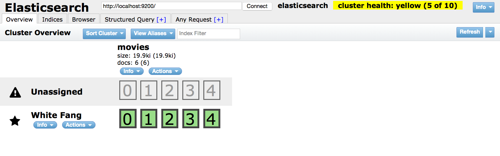

# WORK IN PROGESS

------------------------------------
# Spatial Search Showdown

Spatial search techniques in PostGIS and ElasticSearch: fast and scalable search
against a large spatial dataset with both geographic and text queries. 

**image TBD**  

## Overview 

When looking at potential solutions for geographic data and search engines, there were many contenders, two of which 
I will look at in more depth: **PostGIS** and **ElasticSearch**. I'll give an overview
of the installation and setup process then compare their performance with some simple benchmarks.
The intention is not to provide a full tutorial for either technology; rather I hope
to convey the general tradeoffs you might consider when evaluating your options.

We'll use the 
[GeoNames](http://www.geonames.org/)
database which provides 8+ million points representing named geographic locations.


### GeoNames

<Overview of geonames database>

### Why PostGIS and ElasticSearch

**PostGIS**, the spatial extension to the ubiquitous PostgreSQL relational database, 
was chosen largely because it's currently the most proven and advanced open source 
spatial database. So it's big on the spatial data but not 
as well regarded or widely used for its search.

**ElasticSearch**, on the other hand, is tightly focused on distributed search.
It's a highly searchable, highly scalable document store, not a database. 
The ElasticSearch spatial extensions can index geographic coordinates and 
provides basic geo search capabilities. 
So, ElasticSearch is big on the fast, scalable search with some spatial capabilities added on.

## Methodology

Rather than going into extensive detail on the setup and tuning of these systems,
I'll try to use and reference the standard best practices rather than invent new
solutions. 
In other words, the experience should mimic the "out-of-box" experience for
most developers just digging in.

1. Install software as virtual machines
2. Load geonames data
3. Run benchmarks

## Installation


Both postgis and elasticsearch were installed to two separate virtualbox virtual machines 
running Ubuntu 14.04 64-bit.
Vagrant was used to orchestrate the setup and the setup was done via shell scripts.
After running `vagrant up` in the root directory, I get two running VMs with ports 
`9200` (for elasticsearch) and `5432` (for postgres) available to the network.

### Networking

Instead of using host-only network (the vagrant default for virtualbox machines),
we set up a private network with static IPs to allow more accurate modeling
of most production environments:

* `192.168.99.2` is the `db` box running postgres
* `192.168.99.3` is the `es` box running elasticsearch 

### Postgres setup

We can run this to test the connection:

    psql -d geonames -U postgres -h 192.168.99.2


### ElasticSearch

ElasticSearch required that we explicitly bind it the IP address on our private network.
See the `elasticsearch.yml` file.

We can confirm it is working by visiting `http://192.168.99.3:9200/_plugin/head/` - which gives you
something like this: 



Not pretty but a passable web user interface. My preferred way to test it is using
`curl` to make requests through the HTTP interface. In this example we just post 
a json document with some info about a city; that's the essence of elasticsearch.
No

    curl -XPOST http://192.168.99.3:9200/test/city/ -d '
    {"city": "Anchorage", 
     "state": "AK",
     "location": {
       "lat": "61.2180556",
       "lon": "-149.9002778"}}'

## Loading data

Geonames and postgis have been around for a while and there are plenty of tutorials
and blog posts for getting geonames data into postgis.

The most comprehensive solution was [geonames-for-postgis](https://github.com/perrygeo/geonames-for-postgis) which I forked from [jvarga](https://github.com/jvarga/geonames-for-postgis). It
is one big shell script which downloads from geonames.org and creates a highly optimized, indexed 
postgis-enabled database from scratch. It's a bit fragile and needs quite a bit of tweaking
if you want to customize the behavior. But, once working, it is a rock solid and reliable 
way to reproduce the database with a single command.

    $ ./build_geonames.sh
    ...
    $ psql -h 192.168.99.2 -U postgres geonames -c "SELECT count(1) FROM geoname;"
      count
    ---------
     9993388
    (1 row)

Great, about 9.9 million rows in the `geoname` table. Let's look at that table 
in more detail:

    $ psql -h 192.168.99.2 -U postgres geonames -c "SELECT * FROM geoname LIMIT 1"
       id    | geonameid |   name    | asciiname | alternatenames | latitude | longitude | fclass | fcode | country | cc2 | admin1 | admin2 | admin3 | admin4 | population | elevation | gtopo30 |   timezone    |  moddate   |                      the_geom
    ---------+-----------+-----------+-----------+----------------+----------+-----------+--------+-------+---------+-----+--------+--------+--------+--------+------------+-----------+---------+---------------+------------+----------------------------------------------------
     2315965 |   3106116 | Venturada | Venturada | Venturada      | 40.79717 |  -3.61974 | P      | PPLA3 | ES      |     | 29     | M      | 28169  |        |       1193 |           |     865 | Europe/Madrid | 2012-03-04 | 0101000020E6100000302FC03E3AF50CC019ADA3AA09664440
    (1 row)

Now we can start executing more interesting queries: here's an example of a spatial query 
with a naive text search for the string `hof` in both the `name` and `alternatenames` fields.

```sql
SELECT name, country
FROM geoname
WHERE geoname.the_geom && ST_MakeEnvelope(10.9351, 49.3866, 11.201, 49.5138, 4326)
AND (geoname.name LIKE '%hof%'
  OR geoname.alternatenames LIKE '%hof%');

                       name                        | country
---------------------------------------------------+---------
 Ritzmannshof                                      | DE
 Bahnhof Nürnberg-Doos                             | DE
 Doos                                              | DE
 Atzenhof                                          | DE
 Weigelshof                                        | DE
 Schafhof                                          | DE
 Bahnhof Nürnberg-Ost                              | DE
...
```

This query clocks in at a blazing fast (about 0.35 ms) thanks to the many optimizations 
in the `build_geonames.sh` script.

```sql
EXPLAIN ANALYZE
SELECT name, country
FROM geoname
WHERE geoname.the_geom && ST_MakeEnvelope(10.9351, 49.3866, 11.201, 49.5138, 4326)
AND (geoname.name LIKE '%hof%'
  OR geoname.alternatenames LIKE '%hof%');
--------------------------------------------------------------------------------------------------------------------------------------------------------------------------------------------------------------------------------------------------
 Bitmap Heap Scan on geoname  (cost=9.85..761.09 rows=1 width=17) (actual time=0.148..0.254 rows=37 loops=1)
   Recheck Cond: (the_geom && '0103000020E61000000100000005000000ADFA5C6DC5DE25401A51DA1B7CB14840ADFA5C6DC5DE2540A857CA32C4C14840F4FDD478E9662640A857CA32C4C14840F4FDD478E96626401A51DA1B7CB14840ADFA5C6DC5DE25401A51DA1B7CB14840'::geometry)
   Filter: (((name)::text ~~ '%hof%'::text) OR (alternatenames ~~ '%hof%'::text))
   Rows Removed by Filter: 191
   ->  Bitmap Index Scan on idx_geoname  (cost=0.00..9.85 rows=191 width=0) (actual time=0.134..0.134 rows=228 loops=1)
         Index Cond: (the_geom && '0103000020E61000000100000005000000ADFA5C6DC5DE25401A51DA1B7CB14840ADFA5C6DC5DE2540A857CA32C4C14840F4FDD478E9662640A857CA32C4C14840F4FDD478E96626401A51DA1B7CB14840ADFA5C6DC5DE25401A51DA1B7CB14840'::geometry)
 Total runtime: 0.350 ms
(7 rows)
```


## Data model and relationships

That's the `geoname` table, the main data source. But there are several other 
secondary tables which provide some crucial information. 
Let's explore some of the relationships. 

And now we can perform our same query as before but join it with the featurecodes
table to get additional context about the place name.

```sql
SELECT g.name, g.alternatenames, g.country, g.fcode, f.code, f.name, ST_GeoHash(g.the_geom)
FROM geoname AS g
JOIN featurecodes AS f
ON f.code = g.featurecodeid
WHERE g.the_geom && ST_MakeEnvelope(10.9351, 49.3866, 11.201, 49.5138, 4326)
AND (g.name LIKE '%hof%'
  OR g.alternatenames LIKE '%hof%');

  name                        | country |  code   |            name            | description
---------------------------------------------------+---------+---------+----------------------------+----------------------------------------- --------------------------------------------------------------------
 Ritzmannshof                 | DE      | P.PPL   | populated place            | a city, town, village, or other agglomer ation of buildings where people live and work
 Bahnhof Nürnberg-Doos        | DE      | S.RSTN  | railroad station           | a facility comprising ticket office, pla tforms, etc. for loading and unloading train passengers and freight
```

## Getting data into ElasticSearch

A stream of data, directly from postgres. JDBC River. TODO

Clean up

    curl -XDELETE '192.168.99.3:9200/_river/geonames_jdbc_river/'
    curl -XDELETE '192.168.99.3:9200/geonameidx'

Post a new "river" to grab data from postgis. See json file for details.

    curl -XPOST '192.168.99.3:9200/_river/geonames_jdbc_river/_meta' -d @create_river_geo.json

This will take a while, you can check the web interface or GET this URL:

    curl '192.168.99.3:9200/_river/jdbc/*/_state?pretty'

And now query it. See the json file for details.

    curl -XPOST '192.168.99.3:9200/geonameidx/_search' -d @geoquery.json


## Wrapper web service


# Next steps

## Benchmarks

ab -n 10000 -c 10 "http://localhost:5000/geonames/search?bbox=-121.39277590296751,44.88370349926848,-121.05151308558469,45.13322931873461"

for i in {1..10}
 do
   curl -s -w %{time_total}\\n -o /dev/null "http://localhost:5000/elasticsearch/search?bbox=10.9351,49.3866,11.201,49.5138"
done

    0.215

 for i in {1..10}
 do
   curl -s -w %{time_total}\\n -o /dev/null "http://localhost:5000/postgis/search?bbox=10.9351,49.3866,11.201,49.5138"
 done

    0.019

Wow, postgis is > 10x faster

reusing sessions with the `requests` lib brings es down to `0.153`


## ab testings

A couple different server options

    uwsgi --http :8000 -w app:app --venv /Users/mperry/env/geonames/  -p 8
    gunicorn app:app -w 8
    python gevent.wsgi.py
    python twisted.wsgi.py

Test with

    ab -n 1000 -r -c 120 \
    "http://127.0.0.1:8000/geonames/search?bbox=-121.39277590296751,44.88370349926848,-121.05151308558469,45.1332293187346&provider=postgis"


Server                                     |  Median request time
-------------------------------------------|-----------------------
uwsgi with -p 8 workers                    |  162 ms
gunincorn with -w 8 workers                |  158 ms
tornado                                    |  553 ms 
gevent                                     |  592 ms 
built-in flask server                      |  655 ms 


## Front end


